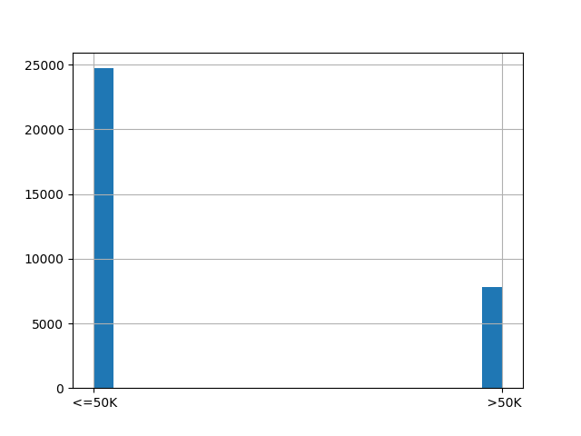
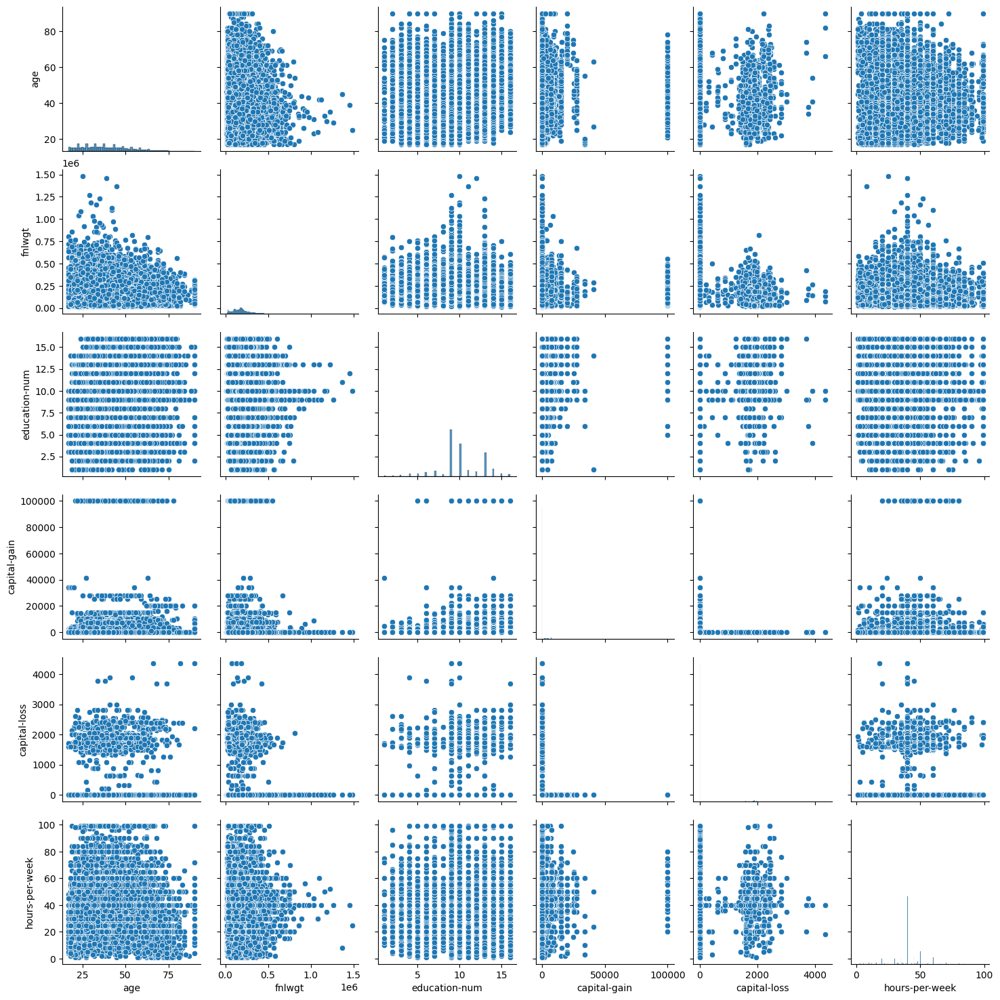
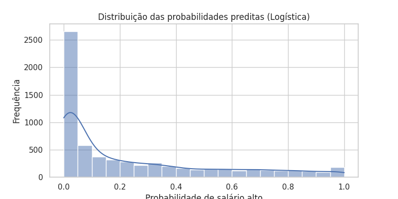
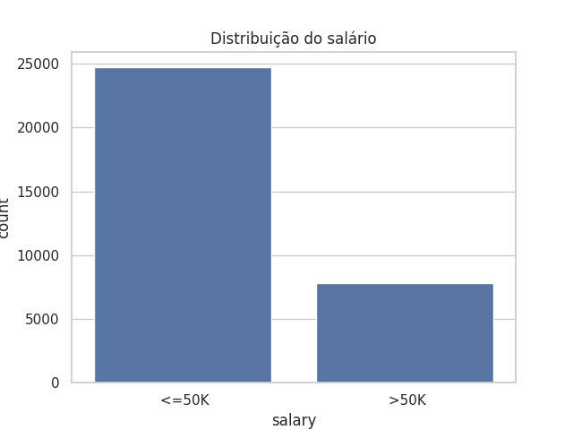

# Comparação entre modelos com regressão linear e logística (Atividade 3)

### Como executar

No diretório do projeto crie o ambiente virtual do Python (venv):

```
python -m venv ./ia-venv
```

Entre no ambiente virtual:

(Linux)
```
source ./ia-venv/bin/activate
```

(Windows)
```
.\ia-venv\Scripts\activate.bat
```

Instale as dependências nesse ambiente virtual:

```
python -m pip install pandas scikit-learn seaborn matplotlib
```

Para executar o script de regressão linear, execute:

```
python Scripts/Atividade_03/regresLinear.py
```

Para executar o script de regressão logística, execute:

```
python Scripts/Atividade_03/regresLogistica.py
```

# Relatório – Previsão de Salário

## 1. Carga e Exploração Inicial dos Dados

O dataset **“Salary Prediction Classification”** contém **32.561 registros** e **15 colunas**, sendo:

- **Variável alvo (target):** `salary` (`<=50K` ou `>50K`)  
- **Variáveis explicativas (features):** numéricas (`age, education-num, capital-gain, capital-loss, hours-per-week, fnlwgt`) e categóricas (`workclass, education, marital-status, occupation, relationship, race, sex, native-country`).

**Análise inicial:**

- Nenhum valor nulo detectado.  
- Distribuição das classes da variável alvo:

| Classe | Contagem |
|--------|----------|
| <=50K  | 24.720   |
| >50K   | 7.841    |

- Observa-se desbalanceamento, com mais casos de salário <=50K.
- Visualizações geradas: histograma do salário, pairplots entre variáveis numéricas, contagem das categorias.

**Gráficos:**

  
*Histograma da variável alvo `salary`.*

  
*Pairplot entre variáveis numéricas.*

**Discussão:**

- **Variável alvo:** `salary`  
- **Variáveis explicativas relevantes:** idade, educação, horas por semana, capital-gain/loss, ocupação, estado civil, etc.  
- **Transformações necessárias:** codificação de variáveis categóricas via One-Hot Encoding; padronização de variáveis numéricas para algoritmos sensíveis a escala.

---

## 2. Preparação dos Dados

- Categóricas codificadas via **One-Hot Encoding**.  

```
categorical_cols = df.select_dtypes(include='object').drop('salary', axis=1).columns
df_encoded = pd.get_dummies(df, columns=categorical_cols, drop_first=True)
```

- Variáveis numéricas padronizadas (**StandardScaler**).

```
numeric_cols = ['age','education-num','capital-gain','capital-loss','hours-per-week','fnlwgt']
scaler = StandardScaler()
df_encoded[numeric_cols] = scaler.fit_transform(df_encoded[numeric_cols])

numeric_cols = ['age','education-num','capital-gain','capital-loss','hours-per-week','fnlwgt']
scaler = StandardScaler()
df_encoded[numeric_cols] = scaler.fit_transform(df_encoded[numeric_cols])
```

- Divisão treino/teste: **80/20**, mantendo proporção das classes.

```
X = df_encoded.drop('salary', axis=1)
y = df['salary'].apply(lambda x: 1 if x.strip()=='>50K' else 0)
X_train, X_test, y_train, y_test = train_test_split(X, y, test_size=0.2, stratify=y, random_state=42)
```

---

## 3. Modelagem – Regressão Linear

- Modelo treinado (`LinearRegression`) para prever a variável binária codificada (`0` para <=50K e `1` para >50K).  

**Métricas no conjunto de teste:**

```
mae = mean_absolute_error(y_test, y_pred_lr)
mse = mean_squared_error(y_test, y_pred_lr)
rmse = np.sqrt(mse)
r2 = r2_score(y_test, y_pred_lr)
```

| Métrica | Valor |
|---------|-------|
| MAE     | 0.2641 |
| MSE     | 0.1158 |
| RMSE    | 0.3403 |
| R²      | 0.3675 |

**Principais coeficientes positivos (aumentam chance de salário >50K):**

| Feature | Coeficiente |
|---------|------------|
| native-country_Cambodia | 0.2083 |
| marital-status_Married-AF-spouse | 0.1588 |
| native-country_France | 0.1373 |
| occupation_Exec-managerial | 0.1359 |
| native-country_Scotland | 0.1311 |

**Principais coeficientes negativos (diminuem chance de salário >50K):**

| Feature | Coeficiente |
|---------|------------|
| workclass_Without-pay | -0.1609 |
| relationship_Not-in-family | -0.1507 |
| relationship_Unmarried | -0.1361 |
| occupation_Armed-Forces | -0.1350 |
| relationship_Own-child | -0.1256 |

**Observação:**  
A regressão linear fornece uma estimativa contínua que pode ser convertida em classificação usando um limiar (ex: 0.5). Usado principalmente para verificar performance.

**Limitações:** assume relação linear, resíduos normalmente distribuídos e homocedasticidade; valores previstos podem estar fora de [0,1].

---

## 4. Modelagem – Regressão Logística

- Modelo treinado (`LogisticRegression`) para classificar diretamente `<=50K` vs `>50K`.  

**Métricas no conjunto de teste:**

```
print("Acurácia:", accuracy_score(y_test, y_pred_log))
print("Matriz de Confusão:\n", confusion_matrix(y_test, y_pred_log))
print("Classification Report:\n", classification_report(y_test, y_pred_log))
print("ROC-AUC:", roc_auc_score(y_test, y_prob_log))
```

| Métrica | Valor |
|---------|-------|
| Acurácia | 0.8093 |
| Precision | 0.57 (classe 1) |
| Recall | 0.86 (classe 1) |
| F1-score | 0.68 (classe 1) |
| ROC-AUC | 0.9077 |

**Coeficientes e Odds Ratio:**

```
coef_df["Odds_Ratio"] = np.exp(coef_df["Coef"])
print("\nCoeficientes e Odds Ratio:")
print(coef_df.sort_values(by="Odds_Ratio", ascending=False))
```

| Feature | Coef | Odds Ratio |
|---------|-----|------------|
| capital-gain | 2.4142 | 11.18 |
| marital-status_ Married-civ-spouse | 1.1161 | 3.05 |
| education-num | 0.5596 | 1.75 |
| marital-status_ Never-married | -1.4358 | 0.238 |
| relationship_ Own-child | -1.1249 | 0.325 |
| education_ HS-grad | -0.8203 | 0.440 |

**Visualização:**  

  
*Histograma das probabilidades preditas pelo modelo logístico.*

  
*Distribuição das probabilidades preditas (Logística)*

---

## 5. Comparação Linear vs Logística

- Transformando predições da regressão linear em classificação (limiar 0.5) e comparando com regressão logística:

| Abordagem | Acurácia | Precision | Recall | F1 | R² / ROC-AUC |
|-----------|----------|-----------|--------|----|---------------|
| Linear (como classificação) | 0.8408 | 0.75 | 0.51 | 0.61 | R² = 0.3675 |
| Logística | 0.8093 | 0.57 | 0.86 | 0.68 | ROC-AUC = 0.9077 |

**Discussão:**

- **Contexto:** se o objetivo é **decidir se alguém tem salário alto**, a classificação direta (logística) faz mais sentido do que prever o valor contínuo.  
- **Limitações da regressão linear como classificação:** valores contínuos fora de [0,1], relação linear nem sempre válida, resíduos podem não ser normais ou homocedásticos.  
- **Limitações da classificação:** perde informação contínua sobre o valor exato do salário; fornece apenas probabilidade de pertencer a cada classe.

---

## 6. Conclusão e Recomendações

- Para **decisão de faixa salarial**, **Regressão Logística** é recomendada.  
- Regressão linear é útil para interpretar influência das features e prever valores contínuos aproximados.  
- Melhorias sugeridas:
  - Regularização (L1/L2), validação cruzada.  
  - Seleção de features e engenharia de variáveis.  
  - Modelos de ensamble (Random Forest, Gradient Boosting).  

## 7. Processo de execução
- Carregamento e tratamento do dataset (remoção de caracteres inválidos, limpeza, encoding).

- Separação entre tipos de variáveis diferentes (numéricas e categóricas).

- Divisão do conjunto de dados em treino e teste.

- Aplicação dos modelos:
  - Regressão Linear (regressão).
  - Regressão Logística (classificação).

- Avaliação dos modelos com métricas apropriadas.

- Geração de gráficos (Salário (Hist), PairPlot, Distribuição das probabilidades preditas, Distribuição do salário).

## 8. Resumo
O objetivo central é prever se um indivíduo recebe acima ou abaixo de 50 mil anuais. O trabalho iniciou-se com uma rigorosa preparação da base de dados, que abrangeu a limpeza de registros, o tratamento de valores ausentes, a codificação de variáveis categóricas e a padronização das numéricas, garantindo assim a qualidade necessária para a modelagem.

Na etapa de testes, comparamos o desempenho da Regressão Linear com a Regressão Logística. Os resultados evidenciaram que a Regressão Linear é inadequada para este cenário; por ser desenhada para estimar valores contínuos, ela não consegue lidar corretamente com a natureza binária da variável alvo, falha que foi confirmada pela análise dos resíduos e pela inconsistência das previsões.

Em contrapartida, a Regressão Logística demonstrou ser a abordagem ideal. O modelo não apenas apresentou um desempenho superior (validado por uma alta precisão, uma matriz de confusão sólida e uma Curva ROC/AUC eficaz), mas também ofereceu valiosa interpretabilidade através de seus coeficientes, permitindo entender claramente quais fatores aumentam ou diminuem a probabilidade de altos salários. Portanto, conclui-se que a Regressão Logística é a ferramenta recomendada para este problema, unindo precisão estatística à capacidade de explicar o fenômeno estudado.
